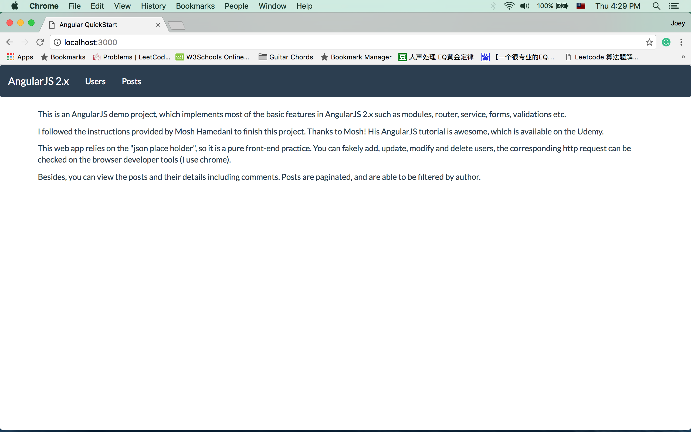
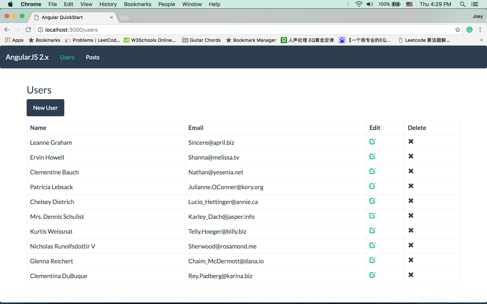
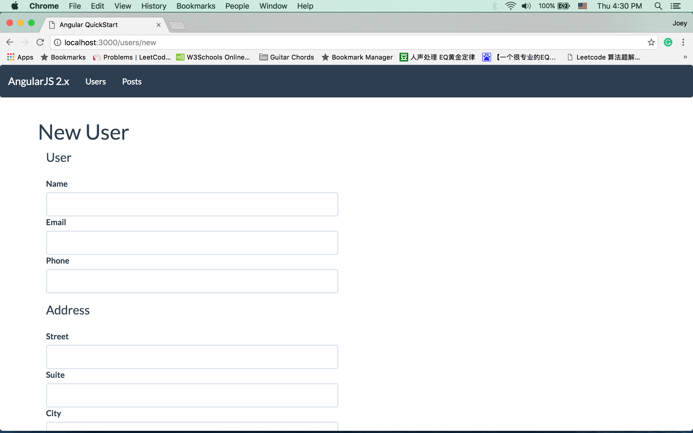
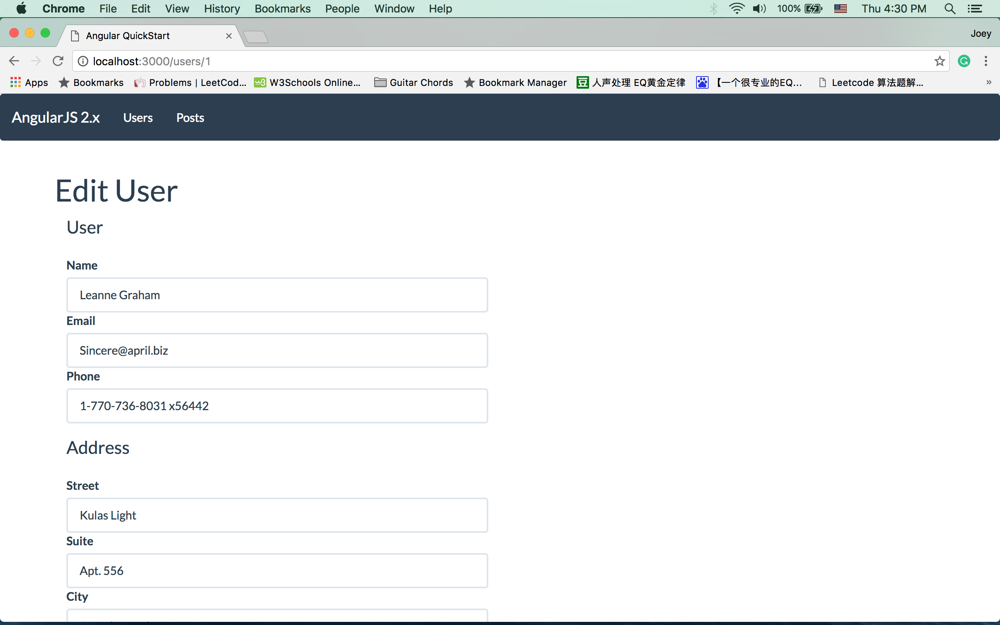
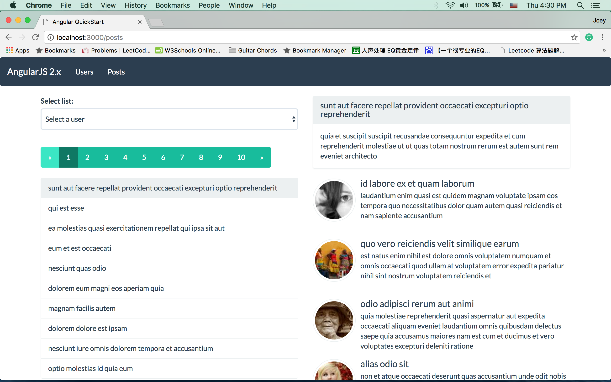

# AngularJS-Demo

## Install Instructions

1. install Node.js
2. sudo npm install -g typescript
3. sudo install -g typings
4. clone my project to your desktop
5. navigate to the project root folder, then type "npm install" to install necessary modules
6. npm start

## Screenshots

### Home

### Users

### New Users

### Edit Users

### Posts

